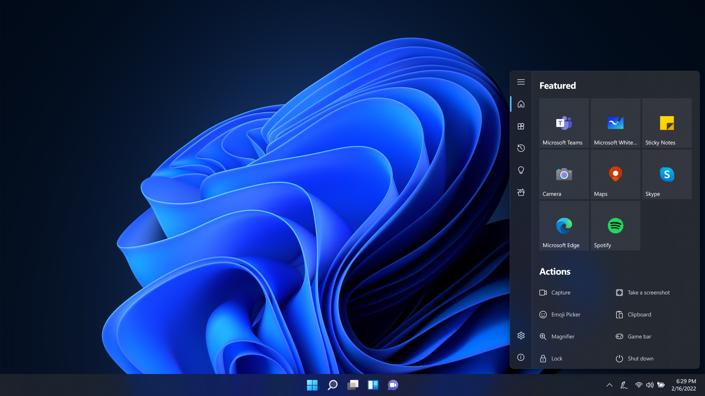

# Ink Workspace

Welcome to the official issue-only repo for Ink Workspace. This is a desktop app that replaces built-in Windows Ink Workspace in Windows 10. App primarily uses WPF and UWP (as XAML Islands) and allows you to run installed apps, sketch notes and captures screen or windows.

  

  

Feel free to share ideas about new features or report bugs.

## Translations
German: [@lorisobidesign](https://twitter.com/lorisobidesign)  
Italian: [@Simizfo](https://twitter.com/Simizfo)  
Portuguese (Portugal): [@esibruti](https://twitter.com/esibruti)  
Spanish (Spain): [@qrbt_ok](https://twitter.com/qrbt_ok)

## New translations
Chinese: [@ZHang233-ai](https://github.com/ZHang233-ai)  
Czech: [@Vaki21](https://github.com/Vaki21)  
French: [@FJduFou](https://github.com/FJduFou)  
Korean: [@jonghyunii](https://github.com/jonghyunii)  
